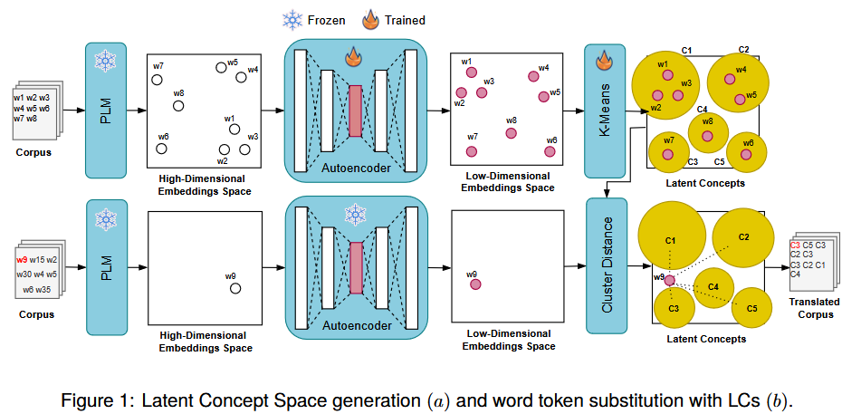
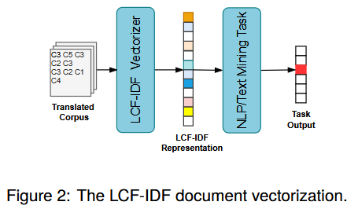
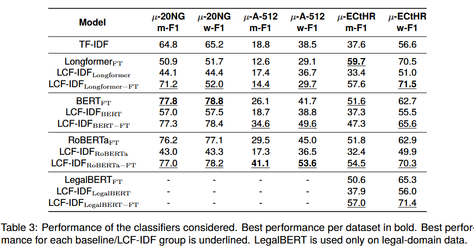
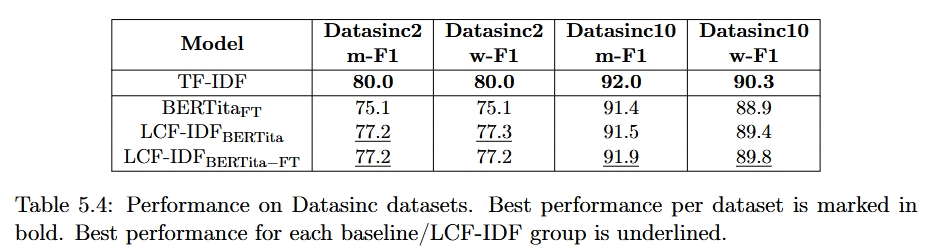

# An LCF-IDF Document Representation Model Applied to Long Document Classification

This repository implements the **LCF-IDF (Latent Concept Frequency - Inverse Document Frequency)** model, designed for **vector-based representation of long documents**. It also provides **TF-IDF and BERT-based baselines** for comparison.

For more details, refer to the [paper](https://aclanthology.org/2024.lrec-main.101/).


## Overview

LCF-IDF enhances document representation by discovering latent concepts within texts. This approach improves classification performance on **long documents**, where traditional bag-of-words and transformer-based models often struggle.

**Concept Discovery & Translation**



**LCF-IDF Pipeline**



## Usage

### Parameters

#### Model Selection:
- `--tfidf`: Enables TF-IDF model.
- `--bert`: Enables a BERT-like model.
- `--ctfidf`: Enables LCF-IDF model.

#### Training:
- `--seed`: Random seed for reproducibility.
- `--dataset`: Dataset used for evaluation.
- `--batch`: Batch size during training.
- `--epochs`: Number of training epochs.
- `--task`: Task type (`binary`, `multiclass`, `multilabel`).
- `--criterion`: Loss function (`bce` for binary cross-entropy, `ce` for cross-entropy).

#### TF-IDF Specific:
- `--ngrams`: Number of n-grams.
- `--num_max_terms`: Maximum vocabulary size.

#### BERT-like Models:
- `--tokenizer`: Hugging Face tokenizer.
- `--lowercase`: Apply lowercasing before tokenization.
- `--embedder`: Hugging Face embedding model.
- `--finetune`: Fine-tune model weights or only train classifier.
- `--ntokens`: Maximum number of input tokens.

#### LCF-IDF Specific:
- `--dimreduction`: Dimensionality reduction method.
- `--nclusters`: Number of clusters for concept discovery.
- `--cluster_alg`: Clustering algorithm.

---

## Models

- `allenai/longformer-base-4096`
- `bert-base-uncased`
- `roberta-base`
- `nlpaueb/legal-bert-base-uncased`
- `dbmdz/bert-base-italian-uncased`
- `dbmdz/bert-base-italian-xxl-uncased`
- `dlicari/Italian-Legal-BERT-SC`
- **LCF-IDF** (using any of the above as the embedding backend)
- **TF-IDF**

---

## Datasets

- `hyperpartisan`
- `newsgroups_small`
- `ecthr_small`
- `eurlex_small`
- `a_512_small`
- `scotus_small`
- `datasinc_2`
- `datasinc_9`
- `datasinc_10`
- `datasinc_19`
- `datasinc_20`
- `datasinc_all`

---

## Running Experiments (Examples)

### BERT-like Model
```sh
venv/bin/python main.py --seed 2003 --dataset datasinc_all --bert --tokenizer dbmdz/bert-base-italian-xxl-uncased --lowercase true --embedder dbmdz/bert-base-italian-xxl-uncased --finetune true --ntokens 512 --task multiclass --criterion ce
```

### TF-IDF
```sh
venv/bin/python main.py --seed 12345 --dataset datasinc_2 --tfidf --lowercase true --task binary --criterion bce
```

### LCF-IDF
```sh
venv/bin/python main.py --seed 1992 --dataset eurlex_small --ctfidf --tokenizer allenai/longformer-base-4096 --lowercase true --embedder allenai/longformer-base-4096 --ntokens 4096 --task multilabel-topone --criterion ce
```

### Custom LCF-IDF
```sh
venv/bin/python main.py --seed 12345 --dataset datasinc_2 --ctfidf --tokenizer dbmdz/bert-base-italian-xxl-uncased --lowercase true --embedder models/12345/protos_2/BERT_bertbaseitalianxxluncase-lcT-ftT-nt512__b8-lr3e-05-p5-bce__Vee13/embedder --ntokens 512 --task binary --criterion bce
```

---

## Results

### Performance on Open Datasets



*μ (mu) denotes "small" datasets in the results.*

### Performance on Proprietary Datasets




## References

For a detailed explanation of ABSTAT's methodologies and applications, refer to the following papers:

- *Principe, R. A. A., Chiarini, N., & Viviani, M. (2024, May). An LCF-IDF Document Representation Model Applied to Long Document Classification. In Proceedings of the 2024 Joint International Conference on Computational Linguistics, Language Resources and Evaluation (LREC-COLING 2024) (pp. 1129-1135).*
---
